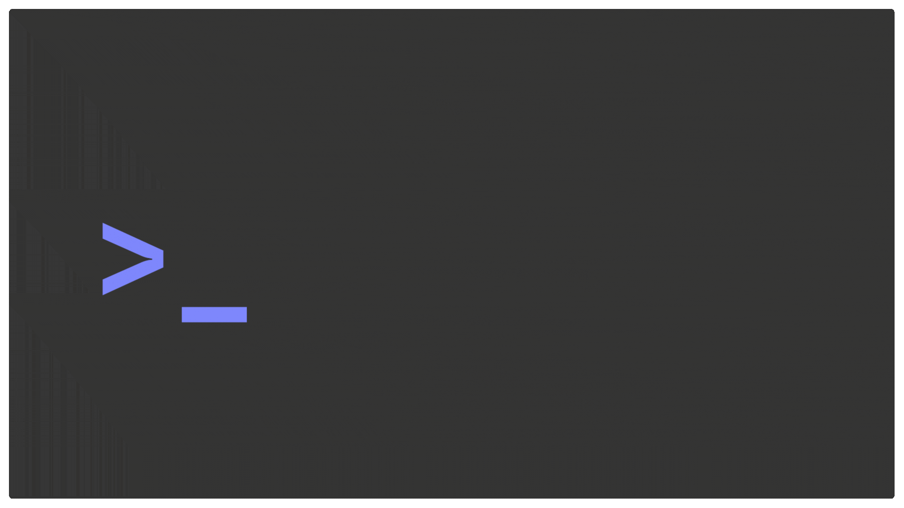
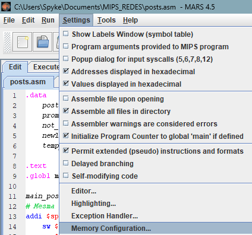

    
    

        Uma rede social de produtividade desenvolvida inteiramente em <strong>Assembly</strong>.
    

---

Projeto final da disciplina de Arquitetura e Organização de Computadores, baseado na notícia *Veja o que acontece com seu cérebro quando você faz uma pausa nas redes sociais[^1]*

[^1]: https://www.nationalgeographicbrasil.com/ciencia/2025/01/veja-o-que-acontece-com-seu-cerebro-quando-voce-faz-uma-pausa-nas-redes-sociais

#  Como executar

1 - No mars, selecione as seguintes opções de settings. 

    Assemble all files in directory

    Initialize Program Counter to global "main" if defined

2 - Nas opções de BitMap

    

    

# Ideia do projeto

A proposta de projeto foi o desenvolvimento de um programa em Assembly MIPS que tenha alguma relação com a notícia fornecida pelo docente.

A partir disso, pensamos em criar uma rede social voltada à reparação dos danos causados pelas grandes plataformas, combatendo o vício dopaminérgico dessas redes sociais.

O *Pondera* tem como princípio uma interface simples e estrutura voltada para a produtividade, como, por exemplo, a divulgação de projetos ou conquistas pessoais do usuário.

A seção de comentários é focada em incentivar críticas construtivas ou incentivos positivos, evitando toxicidade e spam.

# Estrutura inicial
> [!NOTE]
> Esta seção está passível de mudanças.

Um arquivo (**flag.txt**) vai representar os métodos dentro do programa, definidos nos arquivos de métodos do programa.

A interação com o usuário é feita completamente através desse arquivo, que redireciona as ações conforme a flag indicada pela interação com a interface. A interação do usuário acontece com um arquivo .asm, rodando em loop, que interage com o **flag.txt**.

Esse redirecionamento aponta para outros arquivos temporários, como um arquivo de texto ou um arquivo de representação de uma imagem, os quais processam essas informações e armazenam no "banco de dados" geral.

### Post

Um **post** deve conter o nome do usuário, texto e imagem, informações que vão ser acessadas pela interface gráfica e atualizadas conforme a interação do usuário com a interface.

Os posts são identificados com uma letra (**P**) e um número (**ordem crescente**), assim como todos os outros atributos do projeto.

### Comentário

Um **comentário** é referenciado pelo identificador do post com que ele se relaciona e um identificador próprio, e deve conter nome do usuário e texto.

Um comentário que referencia o post de código **P1**, por exemplo, pode ser identificado por **P1Cn**, em que $n$ é o número de identificação do comentário.

## Modelo relacional dos componentes do projeto

<figure align="center">
    
</figure>

## Ideia de implementação

O usuário executa um arquivo .asm e insere suas tarefas/tem suas tarefas inseridas pelo acesso ao armazenamento do aplicativo. Essas informações serão armazenadas em um arquivo temporário e serão usadas para determinar a quantidade de posts que o usuário da sessão poderá acessar.

A partir disso, o usuário acessa um post (aleatório ou não, a definir) do arquivo de posts e tem algumas opções partindo desse ponto. Ele pode comentar no post, acessar a aba de comentários, avançar para o próximo post ou acessar o próprio perfil.

A ação do usuário determina qual tipo de entidade será acessada, **posts** ou **comentários**, que possuem atributos próprios que são interagíveis.

As tarefas do usuário devem ser características à parte das entidades, apenas afetando o pipeline principal do aplicativo, podendo ser cumpridas a qualquer instante do uso da rede social.
